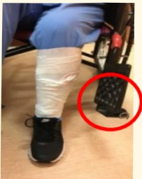
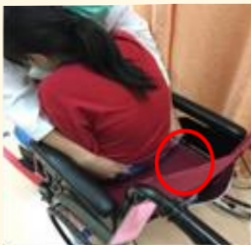
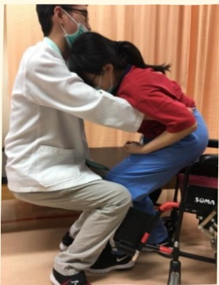
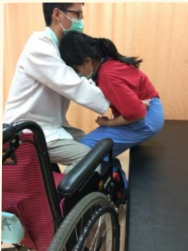

# 認識單側無力病人的轉位

✓適用對象：單側（或雙腳）無力的病人

目標：安全地從床轉移到輪椅或輪椅轉移到床

## 轉位前的準備

## 輪椅擺放位置

輪椅與床

約 30 度角

有力氣的肢體靠近目的地！

## 確保安全

● 確認輪椅剎車上鎖

● 確認輪椅踏板掀起或外旋

● 不可拉扯點滴線

● 尿袋鎖緊，掛在病人身上

## 病人準備坐姿

● 屁股向前移

● 雙膝彎曲約 90 度

● 雙腳平放地面

## 轉位流程

照護者雙腳擺

(2種方法擇一)

方法1：單腳無力者適用

● 照護者單腳放在病人雙膝之間

● 照護者雙腳呈現前弓後箭姿勢

## 方法2：單/雙腳無力者皆適用

● 照護者雙腳夾住病人無力側的膝蓋最前緣

## 手部擺放位置

● 病人：用有力的手抱住照護者或放至目的地上

● 照護者：雙手抓住病人褲頭或環抱病人腋下

## 帶起病人（重點！）

● 病人身體前傾  
照護者向後移重心、微蹲、腰挺直

**方法1：單腳無力者適用**

  
  

**方法2：單/雙腳無力者皆適用**

  
  

照護者雙腳需持續夾住病人膝蓋  

坐下時安全確認  
坐穩前，病人保持前傾姿勢  

避免病人身體往後倒！  

## 參考文獻

1. Davies, P. M. (2000). Steps to follow: the comprehensive treatment of patients with hemiplegia. Springer Science & Business Media.  
2. 簡盟月(2003)·中風病人的物理治療：半身不遂病人的整體治療·合記。

| 聯絡資訊 |
|---------|
| 義大醫院地址:高雄市燕巢區角宿里義大路1號 電話:07-6150011 |
| 義大癌治療醫院地址:高雄市燕巢區角宿里義大路21號 電話:07-6150022 |
| 義大大昌醫院地址:高雄市三民區大昌一路305號 電話:07-5599123 |