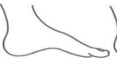
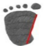

# 認識幼兒扁平足及復健運動

## 什麼是扁平足？

人體的足部有一個「足弓」的構造，而扁平足就是指腳踏地時足弓有塌陷消失的現象。

正常足弓

高足弓

扁平足弓

## 從腳印看扁平足：

嚴重

扁平足

輕度

扁平足

正常

高足弓

## @ 扁平足該怎麼辦?

2 歲以前: 嬰幼兒由於足弓尚未發育完全, 且足底有肥厚的軟組織, 2 歲前的外觀呈扁平。

2-8歲(足弓發育期): 可加強運動治療或使用矯正鞋(墊), 誘導足弓發育。

8歲以後: 使用功能性鞋墊改善異常的生物力學。

若小朋友走一段路就喊脚痛、易跌倒、「外八」或「內八」時，可請教復健科醫師或物理治療師進行評估。

## 一、 運動目的：提升足部小肌肉的力量，撐起足弓二、運動處方：詳見下圖。

<table border=1 style='margin: auto; width: max-content;'><tr><td style='text-align: center;'>墊腳尖運動</td><td style='text-align: center;'>腳趾抓地運動</td><td style='text-align: center;'>跳躍和沙地草地行走</td><td style='text-align: center;'>伸展運動</td></tr><tr><td style='text-align: center;'>支撐5秒，再慢慢放下貼地，重複10次。</td><td style='text-align: center;'>腳趾抓起毛巾或珠珠，維持5秒放下，重複10次。</td><td style='text-align: center;'>多做跳躍的動作及行走於不平穩地面來促進腳部肌肉發展。每回10下</td><td style='text-align: center;'>弓箭步，身體慢慢下壓，維持10秒重複10次。</td></tr></table>

## 參考資料 hara, et al, the effects of short foot exercises to treat flat foot deformity: a systematic review Journal of Back and Musculoskeletal Rehabilitation, 2023 Jan, 36(1):21-33

義大醫院

地址：高雄市燕巢區角宿里義大路1號

## 聯絡資訊

電話：07-6150011

義大癌治療醫院

地址：高雄市燕巢區角宿里義大路21號

電話:07-6150022

義大大昌醫院

地址：高雄市三民區大昌一路305號

電話：07-5599123

義大醫療財團法人 21×29.7cm 2025.08 印製

2025.05 修訂 HA-11-0035(2)