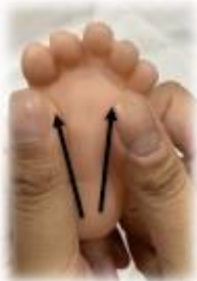
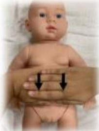

## 認識嬰幼兒按摩

## 按摩目的

促進幼兒神經發展與動作技能

改善幼兒睡眠品質

增加新生兒體重

減少嬰兒絞痛（colic）

減少照顧者壓力與焦慮

增進親子依附感與親密感

## 注意事项

在寶寶安靜清醒狀態時進行按摩

在燈光柔和安靜的環境進行

按摩者避免配戴手飾和手錶進行按摩

過程中寶寶哭鬧或表現不舒服可立即停止

## 按摩頻率：每日1-3次，每次約5-15分鐘

### 1. 腿部

起始：

由大腿滑按至腳踝

腳底：

足跟向腳趾頭方向輕推

腳趾：

溫柔地搓揉每根腳趾

足背：

腳趾頭向腳踝方向輕推

收尾：

由腳踝滑按至大腿

### 2. 腹部

起始：

雙手在腹部輕

輕下壓

腹部：

雙手交替以水

車葉片轉動方

式滑動

雙膝上彎：

將寶寶雙膝彎

曲推向腹部

日月按摩：

雙手交替順時針

畫日月

(左日右月)

雙膝上彎：

將寶寶雙膝彎曲

推向腹部

