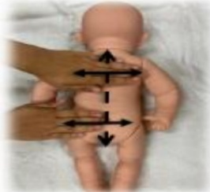
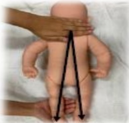

## E-DA HEALTHCARE GROUP

### 3. 手部

| 步驟       | 方法说明 |
|-----------|----------|
| 起始       | 由手臂滑按至手腕 |
| 手掌       | 由手腕往手指頭方向輕推 |
| 手指       | 溫柔地搓揉每根手指 |
| 手背       | 手腕往手指頭方向輕推 |
| 收尾       | 由手腕滑按至手臂 |

### 4. 背部

| 步驟       | 方法说明 |
|-----------|----------|
| 來回撫摸   | 用手掌來回撫摸寶寶的背部，按摩進行方向由頭部至臀部 |
| 全身撫摸   | 從寶寶的背部用手掌輕撫至兩腳的腳跟 |
| 背部畫圈   | 在寶寶的背部用四指指腹畫小圈 |
| 梳狀按摩   | 用手比成梳子狀，按摩方向從背部至臀部 |

## 参考资料：

1. Zhang, Y., Duan, C., Cheng, L., & Li, H. (2023). Effects of massage therapy on preterm infants and their mothers: a systematic review and meta-analysis of randomized controlled trials. Frontiers in pediatrics, 11, 1198730.

2. Yoshida, S., & Funato, H. (2021). Physical contact in parent-infant relationship and its effect on fostering a feeling of safety. iScience, 24(7).

| 聯絡資訊 |
|---------|
| 義大醫院地址:高雄市燕巢區角宿里義大路1號電話:07-6150011 義大癌治療醫院地址:高雄市燕巢區角宿里義大路21號電話:07-6150022 義大大昌醫院地址:高雄市三民區大昌一路305號電話:07-5599123 |

