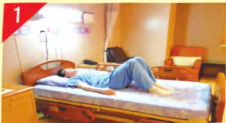
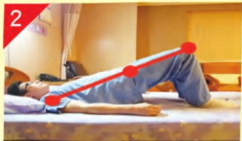
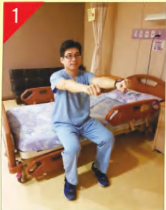
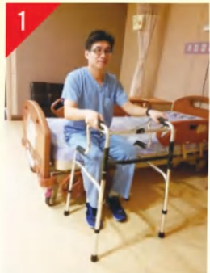

## 保命

## 若想更進一步了解相關內容，請諮詢本院復健科。

| 聯絡資訊 |
|---------|
| 義大醫院地址:高雄市燕巢區角宿里義大路1號電話:07-6150011#2330 義大癌治療醫院地址:高雄市燕巢區角宿里義大路21號電話:07-6150022#2340 義大大昌醫院地址:高雄市三民區大昌一路305號電話:07-5599123#7531 |

中風險性跌倒病人預防跌倒運動一、運動目的：降低跌倒風險，增加力量，促進身體的活動度。

二、運動處方：建議每次15下，一天四回合。

三、注意事項：(1)本衛教單張僅為一般性原則，但個人狀況不盡相同。

(2)若需個別化之動作建議，請諮詢本院復健科。

中風險性跌倒病人預防跌倒運行

影片教學

• 抬臀運動 增加軀幹穩定度，增加核心肌群力量與增加下肢力量。

• 手搖車運動 增加手部的活動度、敏捷度與力量。

雙腳彎曲踩床。

臀部抬高，

肩、髋、膝呈一直線。

臀部放下。

雙腳踩地，雙手握拳舉高到肩膀高度。

兩手向前畫圓圈，

右手先開始。

依序換左手，

向前畫圓圈。

●踢腿運動增加大腿肌群肌力、軀幹穩定度與膝蓋關節靈活度。

雙腳踩地，手扶床板。

右腳向前踢，膝蓋伸直停5秒放鬆並放下。

左腳向前踢，膝蓋伸直停5秒放鬆並放下。

• 踮腳運動增加腳踝活動度與小腿力量，提升平衡靈敏度。

雙手扶好助行器，

頭不暈後再站起。

雙手扶好助行器，

雙腳踮腳尖。

雙腳放鬆踩地，

注意安全不跌倒。