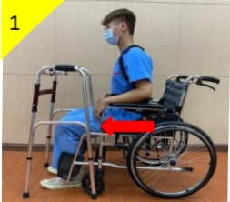
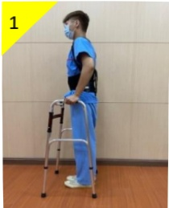
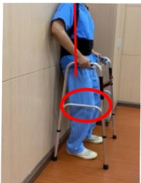

# 腰椎術後 活動與復健

活動技巧篇

復健運動篇

背痛

醫師檢查

藥物治療

物理治療

背架輔助

手術治療

背痛改善## 腰椎手衔後 活動技巧篇

活動目的:正確的轉位動作，可減緩術後疼痛。

注意事項:(1)平躺休息時，可不穿背架，膝蓋小腿下方放置枕頭；

側躺時雙腳微彎，雙腳夾枕頭，可減輕腰部的壓力。

(2)活動或運動時，需正確穿戴背架，可保護您的手術部位。

(3)不需穿背架保護患部的時間，請遵照醫生醫囑。

翻身：對側腳踩床後，全身一起轉（維持脊椎一直線）

起床：側躺後，以雙手支撐床面，或請家屬協助再起床

坐到站：(1)穿好背架，屁股往前移(2)手支撑扶手(3)站起來

助行器行走：(1)助行器往前(2)較沒力的腳先走(3)另一腳跟上

頭不暈

再行走

## 腰椎手術後 復健運動篇

運動目的:手術後配合復健運動，可以提升手術成功率，降低背痛的復發率。

運動處方：維持10~15秒後放鬆，每次15下，每天四次。

## 初階復健運動

| 腹式深呼吸運動(吸氣時肚子微微凸起) | 腳踝上勾 |
|-----------------------------------|---------|
|  |  |
| 膝蓋壓毛巾  | 腳跟壓毛巾  |
| 交替膝彎曲及伸直  | 縮小腹，以背部壓毛巾  |
| 縮小腹，膝蓋彎曲，微微抬高  | 縮小腹，膝蓋伸直，向上抬高  |## 進階復健運動

原地踏步(大腿交替上抬)

踮脚尖

注意事項：(1)手術前即可開始練習本衛教單張之復健運動。

(2)穿著背架時，背板若導致手術傷口不適，可放置毛巾於背板內側。毛巾柔軟可減緩傷口疼痛，提升舒適感。

(3)執行運動時，以不產生手術傷口疼痛為原則。若有疼痛產生，可諮詢物理治療師進行運動處方調整。

(4)頭暈或身體不適時，應暫停運動，預防跌倒。運動量視個人情形而定，切勿過量，會造成手術傷口疼痛。

(5)三個月內避免轉身取物及彎腰。

(6)三個月內避免提重物(雙手總重量不可超過10公斤)。

若想更進一步了解相關內容，請諮詢本院復健科

| 聯絡資訊 |
|----------|
| 義大醫院地址:高雄市燕巢區角宿里義大路1號電話:07-6150011#2330 義大癌治療醫院地址:高雄市燕巢區角宿里義大路21號電話:07-6150022#2340 義大大昌醫院地址:高雄市三民區大昌一路305號電話:07-5599123#7531 |

義大醫療財團法人 29.7 × 42cm 2023.11 印製

2023.11 新設 HA-11-0041(1)