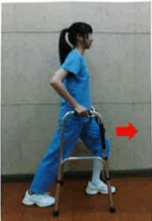
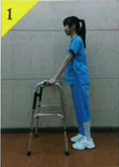

## 髖關節置換術後 居家復健運動

運動目的：逐漸增加髖關節角度與力量，盡早恢復日常活動

運動處方：維持 10~15 秒鐘。每次 15 下，每天四次

### 熱身運動

| 運動名稱               | 图示 |
|------------------------|------|
| 足踝繞圈運動           |  |
| 髖外展運動             |  |
| 髖彎曲運動             |  |
| 髖彎曲運動             |  |
| 髖伸直運動             |  |
| 髖外展運動             |  |
| 大腿後側肌群伸展       |  |
| 小腿後側肌群伸展       |  |
| 直抬腿運動             | —    |

  

緩和運動

| 足背運動 | 膝伸直運動 |
|----------|------------|
|  |  |
|  |  |
| **助行器輔助行走運動** (1)助行器往前 (2)開刀腳先走 (3)另一腳跟上 |  |
|  |  |
|  |  |

---

**注意事项：**  
(1)返家後，建議每天進行四次居家復健運動，每次約30分鐘。  
(2)每項運動可依照您的開刀部位恢復程度，維持5~15秒的力量。  
(3)每次運動後，需冰敷10~15分鐘，並配合醫師開立的藥物處方箋，將開刀腳的疼痛控制好，才會有好的復健成效。  
(4)運動時，若發生強烈的疼痛，請立即就醫，進行醫療處置。  
(5)手術後 6-8 星期內需使用助行器行走，以預防跌倒，直到門診追蹤時醫師認為可以恢復正常活動。  
(6)手術後三個月內，上樓梯，未開刀腳先上階梯；下樓梯，開刀腳先下階梯，以保護開刀腳。上下樓梯有跌倒風險，建議家屬應陪伴。

---

| 聯絡資訊 |
|----------|
| 義大醫院地址:高雄市燕巢區角宿里義大路1號電話:07-6150011#2330 義大瑪治療醫院地址:高雄市燕巢區角宿里義大路21號電話:07-6150022#2340 義大大昌醫院地址:高雄市三民區大昌一路305號電話:07-5599123#7531 |