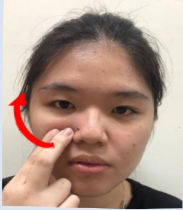

## 顏面神經麻痺復健運動

➢運動處方：維持5-10秒後放鬆，每次15下，每天四次

➢運動處方：維持5~10秒後放鬆，每次15下，每天四次

➢注意重任：臉部若有傷口時，按摩需避開，或請再諮詢復健科

| 按摩部位               |                          |
|------------------------|--------------------------|
|  |  |
| 鼻翼至太陽穴           | 嘴角至耳中               |
|  |  |
| 嘴角至耳中             | 嘴角按摩                 |
|  |  |