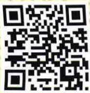
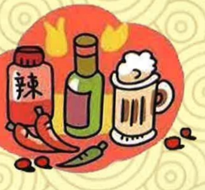

## 四、 参考文献

陳光慧(2019)·中醫護理常規·於張永賢、張曼玲總校閱，中醫護理學概論(四版，227-250頁)·新文京開發。

盧文瑞(2019)·中醫急性創傷傳統徒手治療·台北市中醫師公會。

張維修、陳建霖、黃建榮、黃蕙棻(2019)·足踝扭傷中西醫證治綜論·中醫藥研究論·22(2)31-44。

余新政(2021)·運動傷害的中醫觀·消費者報導雜誌，482，31-33。

義大醫院

地址：高雄市燕巢區角宿里義大路1號

電話：(07)615-0011

義大癌治療醫院

地址：高雄市燕巢區角宿里義大路21號

電話：(07)615-0022

義大大昌醫院

地址：高雄市三民區大昌一路305號

電話：(07)559-9123

本著作權非經製作權人同意不得轉載翻印或轉售

著作權人：義大醫療財團法人

21*29.7cm 2025.01印製 2024.07修訂 HA-8-0010(3)

認識扭挫傷

之中醫照護

扭挫傷是現代常見的外傷疾患，常發生在體各關節韌帶之損傷，因為活動用力不當，引起肌肉、筋膜等組織脈絡損傷，導致氣血運行失常，不通則痛，痛則不通，中醫稱之為傷筋。

## 一、 發生對象

扭傷者乃因突然遭受外力旋轉、牽拉，導致關節、韌帶、肌腱、肌肉超出生理活動範圍時之損傷、撕裂、斷裂或移位；挫傷是受到強烈撞擊，造成肌肉、神經、血管細胞受損，造成局部血腫、組織充血、發炎，進而出現疼痛、瘀腫、行動不利等症狀者。

## 二、 傷筋分期以及自我照護

(一)早期：疼痛劇烈，局部迅速腫脹，2～3天內瘀聚凝結，功能障礙。此期須遵循四原則：

1. 休息-限制繼續負重，可使用輔具行走。

2. 冰敷-每次20分鐘，2~3小時一次，減輕疼痛腫脹發生。

3. 加壓-可使用彈性繃帶，來減少腫脹。

4. 抬高-腿抬高，並高於心臟15~25分，減輕疼痛，切勿自行推拿揉壓。

(二)中期：受傷3～4天後，瘀血漸化，腫脹開始消退，瘀斑轉為青紫，皮膚溫熱，疼痛漸減。此期患處可開始熱敷，或中藥薰洗治療，藉由蒸氣的熱氣、軟化已纖維化的軟組織，疏通經絡、調和氣血、去除瘀血、消除腫痛，從事簡單的活動，注意做好熱身，避免激烈運動。

(三)後期：傷筋2週後，瘀腫大多已消退，瘀斑轉為黃褐色，疼痛漸不明顯，功能輕度障礙，此種殘餘症狀，約經3～5週，症狀全部消失，功能即可恢復。此期仍不宜進行過於激烈的運動，在不痛的原則下，慢慢增加運動強度以恢復肢體耐受性；應注意運動前的熱身以及運動後的保養工作。

## 三、 飲食宜忌

(一)忌食冰冷飲品、生冷食物、香蕉、竹筍、鳳梨、芒果儘量避免食用。

(二)忌食刺激性食物，如菸、酒、檳榔、咖啡及過酸、過辣食物。

(三)攝取充足之食物及水果、加強體力鍛鍊，可多食黑木耳、海參、芝麻、胡桃肉等滋補食品。