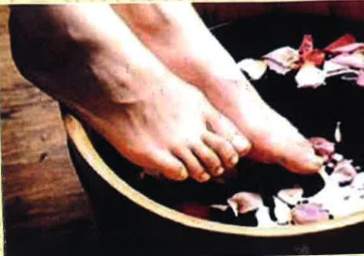

## 認識中藥薰洗 注意事項

義大醫院

地址：高雄市燕巢區角宿里義大路1號

電話：(07)615-0011

義大癌治療醫院

地址：高雄市燕巢區角宿里義大路21號

電話：(07)615-0022

義大大昌醫院

地址：高雄市三民區大昌一路305號

電話：(07)559-9123

本著作權非經製作權人同意不得轉載翻印或轉售

著作權人：義大醫療財團法人

21*29.7cm 2025.01印製 2024.07修訂 HA-8-0015(4)

一、前言

薰洗是中醫外治的重要治療，運用中藥薰

結合現代醫療儀器之電熱效應，其功效可增

中藥薰洗滲透能力，將藥效直接深入皮膚。

二、何謂薰洗治療

熱敷薰洗的方法古稱淋浴，是將藥物置於

或盆中加水煮沸後，以蒸氣薰洗患處的一種

三、薰洗的好處

具舒鬆關節筋絡，疏導調理氣機，流通氣

四、薰洗的適應症

四肢關節損傷所造成的強直、痙攣、酸痛

瘀青、麻木等症状及腰酸背痛、肩膀疼痛、

扭挫傷，例如：媽媽手、五十肩、板機指等。

（二）治療皮膚處有傷口或紅腫熱痛之發炎現象。

六、舒痛外用液

舒痛外用液是由數種中藥材提煉而成，具有

活血化瘀、改善血液循环、消腫止癢、活絡筋骨

及治療肌肉疼痛等療效。

七、薰洗注意事项

（一）治療前請先清洗患部，若有膏、藥布請先去

（二）用舒痛外用液先在患處噴、擦，並做輕度按

（三）薰洗時間每次約10～15分鐘，請保持適當距

離約30公分，感覺局部過漫時可拉長薰洗距

離，以皮膚微紅為準，且薰洗過程嚴禁碰觸

燙傷。

高溫主機、三角瓶瓶口、矽膠管等處，以免

助處理。

（五）若治療局部的感覺較差，請務必先告知醫

護人員，避免燙傷。

八、參考文獻

楊瓊芳（2019）·薰洗療法護理·於張永賢、張

曼玲總校閱，中醫護理學概論（四版，

463-478頁）·新文京開發。