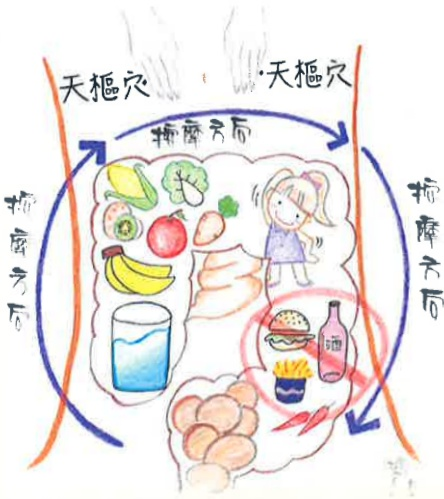

(三)五仁粥：芝麻、松子仁、胡桃仁、桃仁（去皮、尖）、甜杏仁（去心）各30克，粳米100克。

作法：將上述混合用磨碎機磨成粉末，加入粳米煮成粥。

(四) 白木耳飲：將洗淨的白木耳300克及1000-1500CC的水一起熬煮，再依個人喜好加入適量冰糖。

## 七、 参考文献

林姿君、賴奇吟、何宗融（2020）·腸躁症的中醫治療病例報告·中醫藥研究論，23（2）·149-157。

王豪（2021）·習慣性便秘的中醫辨證論治·明通醫藥，531·16-20。

義大醫院

地址：高雄市燕巢區角宿里義大路1號

電話：07-6150011

義大癌治療醫院

地址：高雄市燕巢區角宿里義大路21號

電話：07-6150022

義大大昌醫院

地址：高雄市三民區大昌一路305號

電話：07-5599123

本著作權非經著作權人同意不得轉載翻印或轉售

著作權人：義大醫療財團法人

29.7×20cm 2025.01印製 2024.07修訂 HA-8-0017

## 認識便秘之中醫 照護預防及保健

