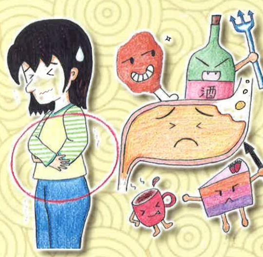

## 腹痛等不適症狀。

二)足三里穴：位於外膝眼下3寸、約4指幅寬脛骨前緣外一橫指(拇指)處，具補虛、調節消化系統功用，可舒緩胃痛、嘔吐、腹胀等不適。

## 六、 參考文獻

東宥任、盧俊良(2019)·功能性食道疾病·臨床醫學月刊，84(4)，692-702。

許睿杰、沈邑穎（2020）·針藥並用治療梅核氣之病例報告·中醫藥研究論叢，23（2），183-197。

許中華（2021）·胃食道逆流之中醫治療·消費者報導雜誌，482，25-27。

許彥彬(2023)·咽喉逆流的臨床症狀、診斷與治療·臨床醫學月刊，92(6)，796-774。

蔡依錚、郭惠雯(2023)·中藥治療肝胃不和型胃食道逆流之探討·中醫藥研究論叢，26

(1)，43-49。

義大醫院

地址：高雄市燕巢區角宿里義大路1號

電話：(07)615-0011

義大癌治療醫院

地址：高雄市燕巢區角宿里義大路21號

電話：(07)615-0022

## 義大大昌醫院

地址：高雄市三民區大昌一路305號

電話：(07)559-9123

本著作權非經製作權人同意不得轉載翻印或轉售

著作權人：義大醫療財團法人

21*29.7cm 2025.01印製 2024.07修訂 HA-8-0019(3)

## 認識胃食道逆流 之中醫照護

胃食道逆流是現代人的通病，與飲食習慣肥胖、壓力和情緒息息相關，典型及非典型狀如下：

## 、典型症狀

- ) 胃酸逆流：無反胃或嘔吐，胃液卻向上逆流到口腔。半夜常被從胃部逆流至喉嚨的酸性液體所嗆醒。

)火燒心、心口灼熱感：從肋骨以下的左上腹(胃所在的位置)至頸部區域，有灼熱、疼痛感，常在飯後1～2小時出現，尤其過飽或暴飲暴食之後最易發生。

## 非典型症状

)胸悶、胸痛（痛點在胃部或胸部下方至頸部間）：常感胸部疼痛常被誤認為心血管或胸腔問題，必須先排除內臟疾病，才能懷疑是胃食道逆流。

口臭：逆流之胃液刺激唾腺分泌大量唾液，導致口內出現苦鹹酸味，胃液也可能侵蝕牙齦導致發炎或口腔乾燥，而使口臭問題更加嚴重。

) 慢性咳嗽：少量胃酸刺激氣管、引起咳嗽；或胃酸刺激食道下端神經，造成反射性咳嗽。

(四)喉球症：胃酸逆流到氣管或聲帶無法排除而導致，常感覺喉嚨卡卡、說話聲音沙啞、常清痰等。

(五)打嗝：進食後消化食物需要的時間變長，初期只是排出氣體，之後食道下括約肌鬆弛，胃容易累積氣體，就會出現胃食道逆流的症狀。

## 三、 飲食宜忌

## (一) 適宜飲食：

1. 低脂、脱脂牛奶或低温殺菌初乳。

2. 新鮮蔬果。

3. 益胃食物：如黑木耳、山藥、秋葵、南瓜、木瓜等，並注意均衡飲食。

## (二) 飲食禁忌：

1. 辛辣刺激：辣椒、洋葱、酸果汁、咖啡等

2. 易產氣食物：豆類及豆製品、高麗菜、玉米、薯條、地瓜、洋蔥、蘿蔔、饅頭、麵包，以免胃腸脹氣引發胃食道逆流。

3. 致腸胃蠕動不適食物：巧克力、甜點、薄荷、柳橙、葡萄柚、含番茄、全脂、牛奶、高脂肪食物（如炸雞腿、煎魚、薯條、油飯）及加工品等。

4. 不易消化食物：如湯圓、粽子、麻糬、甜粿、米糕等，以免增加胃負擔，引起消化性胃痛。

(三) 平均分配飲水量(約2000cc/天)，但勿在進食前及用餐時飲用大量的水或湯，以免稀釋胃酸，使胃酸分泌更多。

## 四、 日常保健

(一)吃飽不要馬上平躺、趴睡：建議，若要躺下，利用枕頭墊高15～20公分較佳，食後不要立刻平躺，最好間隔2～3小時後再就寢。

(二)培養固定運動習慣，於餐後兩小時進行，有助消化並維持體重。

(三)少吃刺激性強之藥物：如止痛藥物（尤其含有鴉片類成份）、口服避孕藥及鈣離子阻斷劑（降血壓劑）等。

(四)減少腹部壓力：避免便秘或穿緊身衣褲或束緊皮帶。

(五)找出壓力源，舒暢情治：因為壓力會使得

胃酸分泌過多、胃食道逆流狀況更加嚴重

，導致惡性循環。

## 五、 中醫穴道按摩

(一)內關穴：位於手臂內側，手腕橫紋正中，沿著兩條筋中間往上約3指寬處，可緩解和預防胃食道逆流、頭暈、噁心嘔吐、上