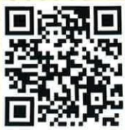

## (二) 合谷穴：

手部虎口處，大拇指根食指併攏，隆起最高點，以大拇指及食指指腹同掐住穴位按壓，約3分鐘，具理氣作用，可改善嘔吐現象及止痛。

## 認識腫瘤之日常養生法

## 六、 外出習慣及戶外踏青

(一)注重個人衛生及清潔，戴口罩、勤洗手，使病菌遠離。

## (二) 杜絕重金属、輻射線及電磁波等汙染物接觸。

三)多接觸大自然，可使人心曠神怡，胸懷開闊，精神放鬆。另外，「睡眠充足」亦是保養身心的重要一環，勿熬夜盡量晚上11點前入睡，配合醫師處方治療計劃，促進身心靈健康。

## 二、 參考文獻

東思穎、唐婉如（2020）·穴位按壓對癌症疲憊之成效：系統性文獻回顧·中西整合醫學雜誌，22（2），11-24。

運憲如、林叔蔓、林麗美、吳秋燕、陳曉容、孫淑惠、江慧珠、鍾淑惠(2023)·腫瘤中醫調理的飲食宜忌護理·中醫護理學(二版)·永大。

## 義大醫院

地址：高雄市燕巢區角宿里義大路1號

電話：(07)615-0011

義大癌治療醫院

地址：高雄市燕巢區角宿里義大路21號

電話：(07)615-0022

## 義大大昌醫院

地址：高雄市三民區大昌一路305號

電話：(07)559-9123

本著作權非經製作權人同意不得轉載翻印或轉售

著作權人：義大醫療財團法人

21*29.7cm 2025.01印製 2024.07修訂 HA-8-0022(3)

義大醫療財團法人

E-DA HEALTHCARE GROUP癌症並非無法治療的絕症，在中西醫治療程中，另類治療通常能輔助疾病的康復，而醫養生理論提倡保養正氣，涉及飲食宜忌、日常起居、精神調攝、運動、藥物、氣功等方面之調理，建議如下：

## 一、 日常起居調節

西方醫學之父希波克拉底曾說：「食物是最好的醫藥」；美國癌症協會(ACS)指出，癌症病人在治療期間若吃得好、營養足夠，有六大好處：

(一)心情較愉快。

(二)保持體力和活力。

(三)維持體重，幫助身體儲存養份。

(四)較能承受癌症治療帶來之副作用。

(五)減少感染風險。

(六)加速傷口癒合，促進復原。

## 二、 精神調攝-放鬆與快樂

現代醫學發現，癌症病人笑口常開，可使病情得到緩解，笑對人體能產生下列作用：

(一)增加肺活量，清潔呼吸道。

（二）抒發健康的情感，消除神經緊張。

（三）促進氣血通暢，增強免疫力。

(四)全身肌肉、神經放鬆。

(五)能散發多餘的精力。

(六)解除愁悶、減輕精神壓力。

(七)增加人與人間之往來和友誼。

## 三、 運動與能量

體能鍛煉能促進氣血流暢，使筋骨強健、臟腑健旺。依自己的體能狀況量力而行，長期有規律鍛煉，不僅對身體大有益處，更能培養毅力，鍛煉心智。

## 四、 飲食調養

(一)秉持「均衡飲食、增加熱量、增加蛋白質」三大原則：治療期間更需要多補充高營養、高維生素等易吸收的食物，能提升身體機能及免疫能力。

(二)採取「少量多餐」：在餐與餐之間適量補充一些營養的點心，以增加體力。

（三）「每日五蔬果」，防癌又健康：發現「蕃茄紅素」及「花青素」是強效的抗氧化劑，可以協助自由基的清除，增強人體免疫系統。

(四)遠離「徽變及燒烤食物」：煙燻或添加亞硝酸鹽肉類，如：香腸、臘肉等，均含有致癌物質。

(五)少吃「高油脂及高糖食物」，世界衛生紙織(WHO)指出，攝取過多糖份及油脂會增加癌症風險，癌細胞喜歡糖類，攝取過多的葡萄糖將加速癌細胞生長，導致癌症惡化。

(六)少吃「加工過的醃漬品」。

（七）「不吃生食」，治療期間免疫機能下降，抵抗力弱，吃生食易引發感染。

## 五、 穴位按摩

## (一) 內關穴：

掌側腕橫紋上2寸(三橫指)處，介於兩條肌肉中央，以指腹按壓，持續3分鐘按壓此穴，可使胃氣下降，通暢胃腸，達到止吐作用。

