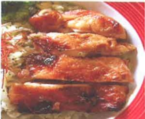

## ★迷迭香烤雞腿

## 【食材】(4人份)

大雞腿2根。

【醃料】

迷迭香少許、醬油1湯匙、鹽少許、糖1茶匙、酒少許。

【作法】

1. 大雞腿洗淨切塊，用醃料醃30分鐘。

2. 将雞腿肉移入預熱的烤箱，以  $ 200^{\circ} $ C 的火力烤30分鐘即可。

## ★蒸牛肉丸子

【食材】

牛絞肉200g、豬絞肉50g、香菜末15g、蔥末15g、紅辣椒絲(裝飾)。

調味料 A：鹽1茶匙、細砂糖2大匙、白胡椒粉1/4茶匙、太白粉2大匙、水100ml。

調味料 B：香油1大匙。

【作法】

1. 将调味料 A 的材料混合备用。

2. 將牛絞肉攪拌至有黏性後，分次加入調味料A，攪拌至水份完全吸收。

3. 接著加入豬絞肉、香菜末、蔥末和香油，拌勻後做成丸狀。

4. 將肉丸放入盤中，電鍋外鍋放半杯水，蒸好後用紅辣椒絲裝飾，即可上桌。