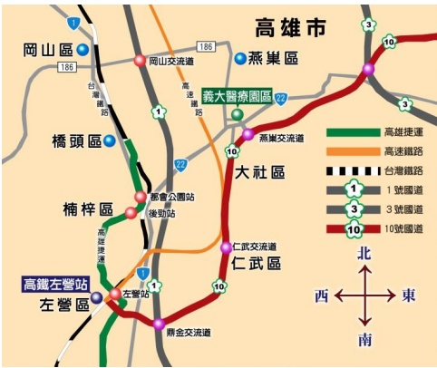

等固定模具冷卻後，掃電腦斷層影像前護理師會來注射顯影劑，顯影劑本身就是溫的，所以注射到體內後有溫熱感是正常的現象。定位結束後，如果身體沒有不舒服的感覺就可以找護理師拔針(拔針處就是在剛剛打針的地方)，若沒有其他需要禁食的檢查，可以多喝水有助於體內顯影劑的排除，之後的治療時間會再電話通知。

## 注意事项

放射師會在身上劃黑線與記號，是之後放射治療前放射師用來擺位與校正姿勢用而非治療位置，洗澡時要注意！可以用清水沖洗,請勿用肥皂搓洗或用力擦拭。若黑線標記消失請勿自己補畫，等到治療時在交由放射師處理。

義大醫療財團法人 關心您的健康

諮詢服務電話：

義大醫院(07)615-0011

義大癌治療醫院(07)615-0022 分機 6813、6787

義大大昌醫院(07)559-9123

制修訂年月：2017年3月制訂

表單編號：HA-12-0008(1)