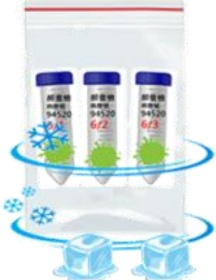

# 痰液檢驗 採檢衛教單

一、檢驗項目：Xpert MTB(結核快速分子檢測)、分枝桿菌培養及抗酸性染色、

痰液常規檢查+需氧菌培養、痰液革蘭氏染色

## 二、 採檢前注意事項：

1、☐ Xpert MTB：領完容器後盡量在院內咳痰後繳交，以利及早診斷。院內咳痰時請至人少的地方，以免交互傳染。

2、痰液檢體留取之最佳時間為早晨第一口痰液檢體。

3、咳痰前，请先以清水漱洗口腔，以免口腔內物質影響檢查結果。

## 三、 採檢步驟：

1、從呼吸道深部用力咳出痰，而不是咳出唾液（口水），將痰吐入50mL無菌離心管，立即將收集盒上蓋，確實鎖緊，切勿再開蓋以免檢體受到污染影響檢驗結果。

2、容器上標註採檢日期後以雙層夾鏈袋包裝。

3、若須留取多套檢體時，請照上述方法每日分別採檢，並於採檢容器上註明日期，連留3天並於第3天繳交全部檢體。

## 四、 採檢後注意事項：

1、將檢體盡快繳交至收件窗口，或以冷藏保存(夾鏈袋外放置冰塊)並在3天內完成送檢。

2、送至檢驗部/科收件窗口時須與收件人員確認資料與日期是否正確。

3、若須採檢3套檢體，可先將前兩天檢體冷藏，再連同第3天檢體一同冷藏送檢。採檢後勿超過3天送檢，如星期一採檢，則最晚星期三當天須送檢。

以雙層夾鏈袋包裝，冷藏保存

傳送過程請於檢體袋外放置冰塊或冰寶，

以維持傳送過程低溫環境。

## 4、 檢體收件時間：

<table border=1 style='margin: auto; width: max-content;'><tr><td style='text-align: center;'></td><td style='text-align: center;'>週一~週五</td><td style='text-align: center;'>週六</td><td style='text-align: center;'>聯絡電話</td></tr><tr><td style='text-align: center;'>義大醫院</td><td style='text-align: center;'>07:00~21:30</td><td style='text-align: center;'>07:00~12:00</td><td style='text-align: center;'>07-6150011 轉 2803</td></tr><tr><td style='text-align: center;'>義大癌治療醫院</td><td style='text-align: center;'>07:00~17:00</td><td style='text-align: center;'>07:00~12:00</td><td style='text-align: center;'>07-6150022 轉 6285</td></tr><tr><td style='text-align: center;'>義大大昌醫院</td><td style='text-align: center;'>07:00~21:30</td><td style='text-align: center;'>07:00~12:00</td><td style='text-align: center;'>07-5599123 轉 7216</td></tr></table>

參考資料來源：EDCP-SOP-T-0301、EDCP-SOP-M-0204、蔡文城(2021)。實用臨床微生物診斷學(第12版)。台北：九州圖書。

<table border=1 style='margin: auto; width: max-content;'><tr><td colspan="3">聯絡資訊</td></tr><tr><td style='text-align: center;'>義大醫院地址:高雄市燕巢區角宿里義大路1號電話:07-6150011</td><td style='text-align: center;'>義大癌治療醫院地址:高雄市燕巢區角宿里義大路21號電話:07-6150022</td><td style='text-align: center;'>義大大昌醫院地址:高雄市三民區大昌一路305號電話:07-5599123</td></tr></table>

義大醫療財團法人 21×29.7cm 2025.04 印製