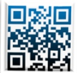

## 胃腸鏡檢查前飲食及清腸劑Fulisay（富利鴻)服用注意事項

## 親愛的貴賓：

為能了解您的健康狀況，請於健檢前三日先掃描QR Code完成相關的評估問卷；若有急性發燒（額溫超過37.5度或耳溫若超過38度）

、呼吸道、咳嗽、味覺症狀等身體不適症狀，請盡速就醫，並延後

健康檢查

敬請於

年 月

評估問卷

點鐘 至 義大醫院六樓

健診中心

## 攜帶物品

身份證

健保卡

糞便檢體盒

常規服用藥物

## 請勿攜帶

耳環

項鍊

戒指

隱形眼鏡

## 卸除美甲

雙手「食指」的

指甲油

光療水晶指甲

交通工具

接受麻醉者請勿自行開車或騎車來院

## 檢查說明書QR Code

消化道檢查說明書

鎮靜止痛說明書

冠狀動脈CT說明書

核磁造影說明書

## 影像學檢查注意事項

檢查項目包含冠狀動脈血管攝影（含顯影劑）、腹部或頭部電腦斷層（含顯影劑）檢查前二天及檢查後二天須停止服用糖尿病藥物（metformin）

## 胃腸鏡檢查前注意事項

長期服用慢性病藥物（如高血壓、心臟疾病及甲狀腺藥物）請依照醫師指示可繼續服用。不需停藥；唯糖尿病藥物請於檢查當日早上暫勿服用，並隨身攜帶藥物至健診中心選擇消化道檢查者，如要加選胃幽門桿菌測試，需額外自費

經鼻高流量濕化氧氣治療：BMI≥35 者經麻醉專科醫師評估適合無痛鏡檢者，一律需額外自費使用以提升麻醉過程呼吸安全（BMI≥30~34 者則建議使用）

