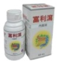

胃腸鏡檢查前注意事項

水分攝取

每天2000c.c.以上

## 低渣飲食

## 檢查前兩天

稀飯

麵條

去皮鱼肉

運動飲料

## 代餐飲食

## 【檢易沖泡式餐點】

早、中、晚餐可各食用一包

將一包加入500c.c.滾熱開水均勻攪拌

水分攝取

靜置10分鐘後即可食用

## 清腸劑使用

肉湯

清腸衛教動畫國語版

檢查前一天

吐司

檢查前一週內每天至少補充2000c.c.水分

請勿食用蔬菜水果、奶類製品、油炸類食物

健檢前請確認糞便檢體是否已留取

間隔1小時

補水 2000c.c.

禁食

第一瓶+250c.c.水稀释

蒸蛋

饅頭

清腸衛教動畫台語版

直接微波爐加熱或隔水加熱

#### 每天2000c.c.以上

早餐：饅頭一顆

午餐：兩包 / 晚餐：一包

用藥提醒APP(Android)

用藥提醒(ios)

檢查當天

05:00 禁食

間隔30分鐘

儘量蹲坐馬桶，促進便意產生，蹲坐馬桶可用椅凳墊高以利排便

第二劑+250c.c.水稀釋

補水 750c.c.

多走動按摩腹部，以溫水沖肛門刺激排便期間會有數次排便，可用溫水清洗減少擦拭肛門口

## 溫馨提醒

喝完瀉劑後開始作用，持續觀察糞水狀態【如左圖】請將最後一次排便情形用手機拍照下來，以利護理人員評估