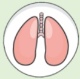

## 肺阻塞（COPD）肺部運動訓練

## 上肢運動—水瓶&啞鈴訓練

## 什麼是肺阻塞？

呼吸道慢性發炎，不可逆的阻塞性疾病

台灣十大死因第八位

症状：咳

痰

## 喘

## 危險因子：

吸菸或二手菸

環境有害物質

或職業接觸

家族史

或其他肺部狀況

## 上肢運動訓練重要性

透過上肢運動，改善上肢肌肉力量，

提高運動耐力及呼吸強度，減緩呼吸喘不適程度。

須經常練習才有效唷!!

訓練頻率

訓練時間

每周3次以上

每次至少20~30分鐘

 $ ^{*} $ 建議頻率與時間提供參考，可依個人狀況增減調整

## 參考資料來源

1. 台灣胸腔暨重症加護醫學會(2022)•2022台灣肺復原實務指引•台北市：台灣胸腔暨重症加護醫學會

2. 台灣胸腔暨重症加護醫學會(2022)•2022奔跑吧!小肺!-肺阻塞的肺部復健衛教手冊

3. 台灣胸腔暨重症加護醫學會(2017)·肺阻塞知多少-台灣肺阻塞全方位照護手冊

## 聯絡資訊

<table border=1 style='margin: auto; width: max-content;'><tr><td style='text-align: center;'>義大醫院</td><td style='text-align: center;'>義大癌治療醫院</td><td style='text-align: center;'>義大大昌醫院</td></tr><tr><td style='text-align: center;'>地址:高雄市燕巢區角宿里義大路1號</td><td style='text-align: center;'>地址:高雄市燕巢區角宿里義大路21號</td><td style='text-align: center;'>地址:高雄市三民區大昌一路305號</td></tr><tr><td style='text-align: center;'>電話:07-6150011 轉 5072 肺阻塞個管師</td><td style='text-align: center;'>電話:07-6150022 轉 6477 肺阻塞個管師</td><td style='text-align: center;'>電話:07-5599123 呼吸胸腔科門診</td></tr></table>