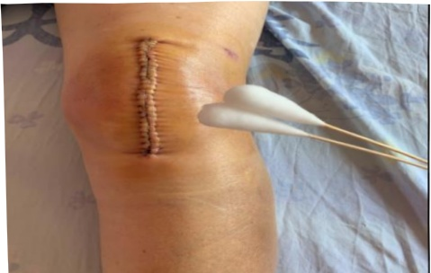

### 6. 傷口護理步驟：

1. 以洗手液或肥皂洗净笺手。

2. 拆開紗布並觀察傷口

3. 以生理食鹽水棉棒，進行傷口清潔，由傷口中心環形向外轉擦拭，逐漸擴大至直徑大於傷口周圍 5 cm，避免來回擦拭。

面，抓住紗布一角取出，對準傷口的中心，覆蓋傷口後，勿再次移動，膠帶固定。

4. 以水溶性優點棉棒，進行傷口消毒，由傷口中心環形向外轉擦拭，逐漸擴大至直徑大於傷口周圍 5 cm，避免來回擦拭。

6. 依醫師指示使用彈繃包紮以及搭配彈性襪穿著