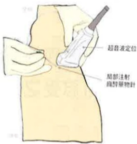

## 二、 術後常用止痛方式

## 拒絕術後疼痛，請勇於說痛

## 術後常用止痛方式有以下幾種：

口服藥：針對較輕度疼痛，按醫師指示服藥，即使目前未有疼痛感仍須服用，才能有較好的疼痛控制。

## 肌肉或靜脈注射(非類固醇或嗎啡類止痛藥)：

每個人對於疼痛耐受性及吸收效果不同、時間上有限制、需依醫師指示固定時間給予，或突發性疼痛需要止痛時使用。

多模式止痛：由麻醉科醫師評估並選擇給藥方式與途徑，利用機器或靜脈、局部給藥，設定安全劑量及鎖定時間，提供給病人自己選擇。

神經阻斷術：在超音波導引下精確定位神經所在，將局部麻醉藥物注射於神經周圍，使神經暫時麻痺，可提供6~8小時止痛效果。施打部位之肢體會有麻木、感覺遲鈍或肌肉無力狀況，待藥效消失後就會恢復正常。

## 三、 除藥物治療外可以減輕疼痛的方法

1. 藉由一些活動來分散對疼痛的注意力，如聽音樂、打牌、打麻將、散步。

2. 放鬆心情、保持愉悅心情，如：可藉由家人或朋友的陪伴，給予心理支持，有助於您減輕對疼痛的感覺。

3.將肢體擺放為您平時感覺最舒服的姿勢。

4.藉由宗教信仰，如：念佛、禱告，來分散對疼痛的注意。

5. 可詢間您的主治醫師是否可藉由冰敷或熱敷減緩疼痛情況。

6.當疼痛無法忍受時，您還是可以告知醫護人員，調整止痛藥物。

## 四、 關於疼痛常見疑問：

1. 使用止痛藥不會影響傷口癒合，反而可因疼痛緩解促進下床，幫助傷口癒合。

2. 止痛藥的副作用：過敏皮膚癢、頭暈、噁心、嘔吐等，都可透過調整劑量改善。

3. 使用自控式止痛：治療目的是用最少劑量的藥，達到病人臥床休息時不覺得疼痛，但在劇烈咳嗽或走動時，仍可能有疼痛感覺，但疼痛程度會減輕許多。