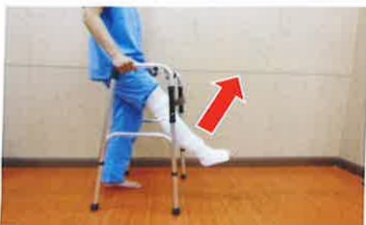

## 二、 手術前該如何停用抗血栓藥物？

由於抗血栓藥物會延長凝血時間，若預計接受人工關節置換術，應主動告知醫師目前正在服用哪種抗血栓藥品？請手術醫師評估是否需事先停藥？也可以回診請教原開立抗血栓藥物醫師是否同意停藥？停藥幾天？因此請依照醫師指示服用抗血栓藥品，並主動告知醫護人員術前是否停藥與停藥日期。切勿自行任意停用以避免停藥天數不足造成出血風險或停藥太久造成栓塞事件發生。

## 三、 手術前須知

1. 入院當天完成抽血檢查、胸部X光、心電圖及麻醉前評估等檢查。

2.為了避免手術時，嘔吐造成吸入性肺炎，故手術前須禁食8小時。醫護人員於晚間9點後告知禁食時間。禁食項目包含：食物、水及任何需要咀嚼物品，如：口香糖、檳榔、糖果。

3.手術前一日或當日，請病人執行患肢及身體沐浴。

4. 手術前，由醫師執行手術部位標示，醫護人員送開刀房前會將手術部位做局部清潔，並包上治療巾。

5. 手術時間約4~6小時，視個人麻醉方式及麻醉甦醒時間而有所不同。若是採用全身麻醉者，麻醉過程中因會喉嚨放置呼吸管協助呼吸，故可能會造成喉嚨疼痛不舒服或有咳出微量血絲情形，可少量多次喝溫開水來改善；但若有持續咳出鮮血情形時，應立即告知醫護人員協助處理。

6.整個手術過程中及術後返回病室時，均需有至少一位家屬陪同。

## 四、 術前復健運動準備

運動時機：手術前

運動目標：維持關節彎曲角度/增加肌肉力量，幫助手術後順利康復

運動頻率：每個動作維持5秒，每回合重複15次，一天4回合。

## 股四頭肌肌力訓練

訓練目的：增加患側肌肉力量，且建議雙邊皆執行

圖片繃帶纏綁肢體為手術患肢示意圖

平躺姿势：将脚向上抬起

## 坐姿：将小腿向上伸直

站姿：将脚向上抬高

