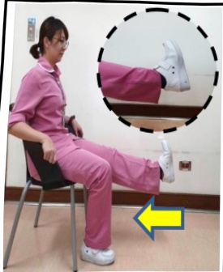
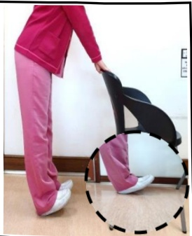

# 肌少症-照護注意事項

## ● 何謂肌少症？

堪稱高齡者失能的隱形殺手，年齡越高罹患肌少症機率就越高，容易造成長者跌倒、骨折、失能、入住機構等風險，更增加死亡機率。

● 肌少症的特徵？

持續感覺沒力氣、無法久走或久站、常跌倒、握力不足，嚴重甚至失能、生活無法自理等。

● 如何防治肌少症？

1. 規律運動、預防跌倒：阻力式運動尤佳，如：使用啞鈴、寶特瓶、彈力帶做重量訓練。其他如：快走、慢跑、游泳、太極拳等。

推牆做伏地挺身

(強化手臂與核心肌群)

起立坐下

(強化下肢和手臂肌力)

雙手上舉

(訓練手臂肌力)

坐姿抬腿

(訓練下肢肌力)

踮腳尖、翹腳趾

(訓練小腿前後側腿肌、平衡及協調能力)

※注意：請選固定、堅固的椅子，每個動作維持 5-10 秒鐘，每回合做 10-15 次，進行 2-4 回合/天，建議一星期至少執行 3 天。