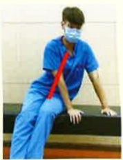
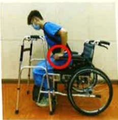

## 三、 手術後活動

### 1. 卧床注意事项：

(1)依醫師指示再下床活動，若您手術後48小時內仍需臥床，至少每2小時以滾木式翻身法(圖一)更換姿勢；若需於床上使用便盆，注意臀部不可以抬高。平躺時可用一枕墊於頭部，另一枕墊於膝下，注意維持脊椎的平直。經醫師許可，身體沒有不舒服症狀下，可將床頭漸進式抬高，可預防姿勢性低血壓，並請留意勿壓迫到手術部位。

對側腳踩床後，再翻身

滚木式翻身法（维持脊椎一直線）

圖一、滾木式翻身之示意圖

(2)床上活動：臥床期間，髖關節及膝關節的活動可在手術傷口可忍受的疼痛範圍下，慢慢增加。上肢、腳、踝關節的關節運動，不影響患部，可盡量活動，每天至少需活動5次以上，以預防深層靜脈桎椏。

### 2. 正確的姿勢轉換：

(1)住院期間為降低傷口疼痛：

a. 可將床頭抬高，維持手術部位的平直與穩定。

b.再轉位坐到床沿，以雙手支撐床面坐起。

c. 家屬在旁協助保護病人。

起

身

側躺後

以雙手支撐床面(或請家屬協助在起床)

坐

到

站

穿好背架，屁股往前移

手支撐扶手

站起來

助行器行走

頭不暈

再行走

助行器往前

較沒力的腳先走

另一腳跟上