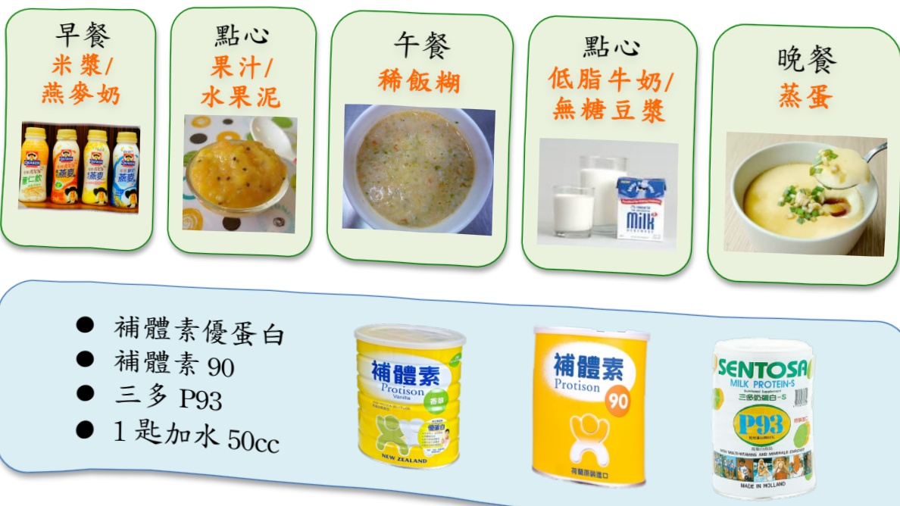

# 全流質/半流質飲食 Full Liquid Diet-<2>

___月___日星期___~___月___日星期___

全流質飲食是含有少量纖維質，營養較清流質飲食均衡，在室溫時為液體的流質食物，可以用果汁機攪打。

● 半流質飲食是將固體食物經由剁碎、絞細處理，加入飲料或湯汁，調製成不需或稍加咀嚼即可吞嚥之飲食。

每餐 50~100c.c，一天 3~6 餐。

● 儘量多補充水分，避免脫水及便秘。

● 可以適當補充蛋白粉、補體素等商業配方。

● 無糖茶類、黑咖啡視個人情況可適量飲用。

☒ 避免油腻湯品、冰淇淋、調味奶、布丁、含糖飲料、汽水、酒精。

早餐米浆/燕麥奶

點心

果汁/

水果泥

午餐

稀飯糊

點心

低脂牛奶/

無糖豆漿

晚餐

蒸蛋

● 補體素優蛋白

● 補體素 90

● 三多 P93

● 1 匙加水 50cc

