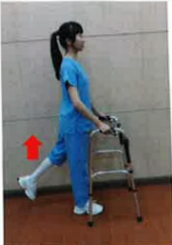

## 髖關節置換術後 居家復健運動

運動目的：逐漸增加髖關節角度與力量，盡早恢復日常活動

運動處方：維持 10~15 秒鐘。每次 15 下，每天四次

熱身運動

<table border=1 style='margin: auto; width: max-content;'><tr><td style='text-align: center;'>足踝繞圈運動</td><td style='text-align: center;'>髖外展運動</td><td style='text-align: center;'>髖彎曲運動</td></tr><tr><td style='text-align: center;'></td><td style='text-align: center;'></td><td style='text-align: center;'></td></tr><tr><td colspan="3">髋關節運動</td></tr><tr><td style='text-align: center;'>髋彎曲運動</td><td style='text-align: center;'>髋伸直運動</td><td style='text-align: center;'>髋外展運動</td></tr><tr><td style='text-align: center;'></td><td style='text-align: center;'></td><td style='text-align: center;'></td></tr><tr><td style='text-align: center;'>大腿後側肌群伸展</td><td style='text-align: center;'>小腿後側肌群伸展</td><td style='text-align: center;'>直抬腿運動</td></tr><tr><td style='text-align: center;'></td><td style='text-align: center;'></td><td style='text-align: center;'></td></tr></table>

