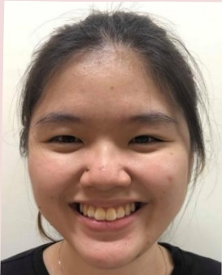

## 臉部運動

<table border=1 style='margin: auto; width: max-content;'><tr><td style='text-align: center;'>抬高眉毛</td><td style='text-align: center;'>皺眉</td><td style='text-align: center;'>用力闭眼</td></tr><tr><td style='text-align: center;'>鼻孔撑大</td><td style='text-align: center;'>大笑</td><td style='text-align: center;'>嘟嘴</td></tr><tr><td style='text-align: center;'>下拉嘴角</td><td style='text-align: center;'>抬起上嘴唇</td><td style='text-align: center;'>下拉下嘴唇</td></tr></table>

美大壓療財團法人 21×29.7cm 2024.07 印製

2024.04 新設 HA-11-0044(1)