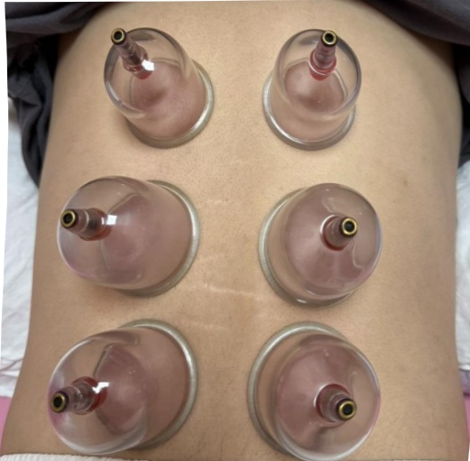

## 七、 參考文獻

張文強、李明芳(2020)·拔罐療法在慢性疼痛病患之應用探討·中醫藥學報，38(2)，45-51。

陳志豪、吳佩雯(2021)·拔罐治療後皮膚反應與照護指引初探·台灣中醫護理雜誌，20(1)，12-18。

Wang, X., Zhang, X., Elliott, J., Liao, F., Tao, J., & Jan, Y. K. (2020). Effect of Pressures and Durations of Cupping Therapy on Skin Blood Flow Responses. Frontiers in bioengineering and biotechnology, 8, 608509. https://doi.org/10.3389/fbioe.2020.608509

義大醫院

地址：高雄市燕巢區角宿里義大路1號

電話：07-6150011

義大癌治療醫院

地址：高雄市燕巢區角宿里義大路21號

電話：07-6150022

義大大昌醫院

地址：高雄市三民區大昌一路305號

電話：07-5599123

# 中醫拔罐 治療須知

