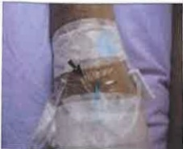

## 捌、 認識化學治療藥物外滲

## 一、 何謂化學治療藥物外滲

是指化學藥物於靜脈注射時，由靜脈注射座或靜脈留置針外滲至周圍皮下組織，使組織發生浸潤、水泡，造成局部肌肉組織壞死。

## 二、 化學治療藥物外滲徵兆

發生以下任何徵象時，請立即告知醫護人員。

1. 注射部位有疼痛、針刺感、燒灼感。

2. 注射部位有發紅、紅斑。

3. 注射部位發生滲漏、腫脹或硬結。

4. 注射管路無回血或流速減慢。

## 三、 化學治療外滲的皮膚症狀

外滲的皮膚症狀從發紅、灼熱、疼痛、水泡至進一步的皮膚潰瘍壞死到深度組織結構損害，可能引起包含神經缺損，組織攣縮和關節僵硬等神經及肌腱的損傷合併症。

末梢血管正常外觀

靜脈注射座正常外觀

靜脈注射座正常外觀