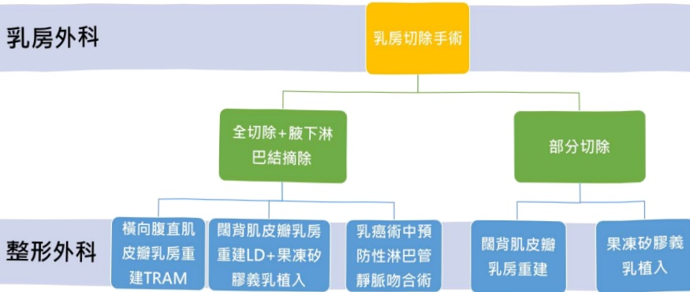

## 粉紅護照

## 整形外科乳房重建手術

乳房是女性最重要的第二性徵，乳癌病患除了要接受罹患癌症對身體及心理的打擊外，還要接受切除乳房所造成乳房殘缺的突然改變，對心理產生的巨大衝擊及莫大的痛苦。

研究表明乳房切除術後的乳房重建可以大幅改善患者對完整身體心像的需求，協助病人盡快渡過乳癌治療的痛苦，回復自在與自信，維持罹癌後的生活品質。

乳癌乳房手術乳房外科與整形外科之角色分佈：

## 乳房外科

重建方式的選擇常須依照患者術後可保留下來的皮膚、組織的數量，全盤考量後才選擇最適合的重建方式。