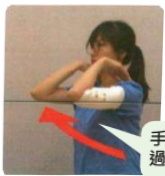

## 術後第一階段復健

● 適用時機：手術後第一週

目的：促進手臂淋巴測肢回流，減輕手臂腫脹。

避免術後淋巴水腫及活動受限，影響日常生活。

1握拳和打開

2. 手腕運動

3. 手肘運動

## 術後第一階段復健

適用時機：手術後第一週

目的：避免肩關節、手臂活動受限。

注意事項：避免傷口過度拉扯。

跟著影片動一動

肩關節屈曲、外展小於等於90度。

1划船運動

2. 輕拍手運動

3. 前抬運動

4. 側抬運動

手肘不能高

過肩勝喔！！