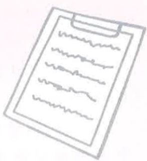

### 4. 外科治療--冠狀動脈繞道手術：

當冠狀動脈阻塞的嚴重情況，不適合以氣球擴張或支架放置來治療時，就需要外科介入來實施冠狀動脈繞道術，以解決病人心肌缺血的問題，及避免心肌梗塞所引起的猝死。

### 5. 藥物治療：

藥物治療可以改善心臟功能，減少發作及症狀減輕，但不能讓狹窄血管還原。目前有多項藥物可用來增加氧氣之供應或減少氧氣之需求，例如硝酸鹽類、乙型交感神經阻斷劑、鈣離子阻斷劑、血管緊縮素轉換酶抑制劑、抗血小板藥物等。

## 五、 心導管執行之注意事項

1. 心導管檢查前：

(1)生理學上評估：

抽血、心電圖、

X 光檢查。

(2) 同意書：

必須包括病人及家屬的同意、簽章。

(3)皮膚準備：

避免減少手術過程感染，故一般執行檢查時，會建議將手臂、大腿以上3/1及雙側鼠蹊部剃毛。

(心導管檢查常見執行部位為手腕或鼠膝部)

(4) 禁食：

緊急檢查時不需禁食。隔日早上執行檢查，請於午夜12點後禁食(包含水、食物)。隔日下午執行檢查，可吃早餐（7AM前進食完畢），早餐後開始禁食（包含水、食物）。