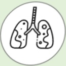

## 肺阻塞 (COPD) 疫苗施打 肺炎球菌疫苗

## 什麼是肺阻塞？

## 呼吸道慢性發炎，不可逆的阻塞性疾病

台灣十大死因第八位

## 症状：咳

痰

## 喘

## 危險因子：

吸菸或二手菸

環境有害物質

或職業接觸

家族史

或其他肺部狀況

## 肺阻塞疫苗施打

1. 依據國內外照護指引建議，COPD病人應接受相關疫苗施打，預防相關感染，以降低急性發作及併發重症，↓住院率及↓死亡率。

2. 2023年國際GOLD指引建議，COPD病人應施打之疫苗：流感疫苗(每年)、肺炎鏈球菌疫苗(國內為13價及23價)、COVID-19疫苗、百日咳疫苗及帶狀疱疹疫苗。

3. COPD病人除65歲以上建議施打外，65歲以下合併慢性疾病者也應施打肺炎鏈球菌疫苗。

## 參考資料來源

1. 台灣胸腔暨重症加護醫學會, 台灣肺阻塞臨床照護指引. 2019.

2. 2023 GLOBAL STRATEGY FOR PREVENTION, DIAGNOSIS AND MANAGEMENT OF COPD. 2023.

## 聯絡資訊

| 医院 | 地址 | 電話 |
|------|------|------|
| 義大醫院 | 高雄市燕巢區角宿里義大路1號 | 07-6150011 轉 5072 肺阻塞個管師 |
| 義大癌治療醫院 | 高雄市燕巢區角宿里義大路21號 | 07-6150022 轉 6477 肺阻塞個管師 |
| 義大大昌醫院 | 高雄市三民區大昌一路305號 | 07-5599123 呼吸胸腔科門診 |