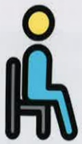

## 穿著

集中衣物

方便拿取

減少鈕扣類衣物

坐著穿衣

避免彎腰

## 煮食與飲食

集中用具及食材

少量多餐

避免吃太飽

細嚼慢嚥避免嗆咳

小撇步

待處理事項

安排優先順序

每週工作

預先計畫分配

避免單日超負荷

## 活動與購物

善用各項輔具

走路愜意又安全

善用有輪拖車

購物採買不費力

## 穿鞋與洗澡

坐著穿鞋或使用鞋拔輔助

避免彎腰

使用長柄刷輔助避免彎腰

步調放慢

不著急

避免彎腰

避免長時間久站

善用工具輔助