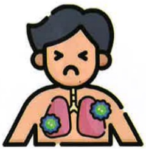

## 一、 什麼是肺阻塞

肺阻塞為台灣十大死因第9名(2022)，每年造成逾5000人死亡，佔台灣民眾死亡率的6%-10%，且第一次住院死亡率達22%。

常見症狀「咳嗽、有痰、喘不停」，常被以為是感冒或氣喘症狀而忽視，若有慢性咳嗽、咳痰，呼吸困难或者曾有暴露在危險因子的病史時，都建議就醫進一步檢查診斷。

## 一、 什麼是肺阻塞

## 危險因子

吸菸

三手菸

環境/職場

粉塵

## 家族史

肺部狀況

反覆感染