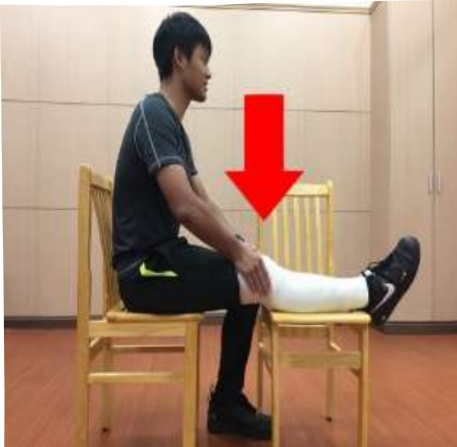

## 六、 衔後第五天

1. 被動性患膝關節角度運動：每天 2 次，每次 30 分鐘。執行角度 90 度。

2. 冰敷：每天 4 次，每次 15 分鐘。

3. 足背運動：每天 4 次，每次 15 下。

4. 股四頭肌及腦旁肌運動：每天 4 次，每次 15 下。

5. 直抬腿運動：每天 4 次，每次 15 下。

6. 屈膝伸膝牵拉運動：每天 4 次，每次 15 下。在可忍受的疼痛範圍下，在彎曲及伸直末端角度，停留 5 秒。目標為增加患膝關節彎曲及伸直角度。

繃帶纏綁肢體為手術患肢示意圖

7. 下床活動: 輔具輔助行走: 每天 4 次, 每次 5 分鐘。助行器使用如第 32 頁。