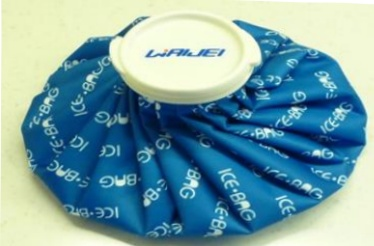

## 伍、 手術前準備

## 一、 用物準備

## (1) 助行器

術後 1–2 天起，醫護人員將教導病人如何使用輔具下床活動

(2)冰敷袋 手術後冰敷傷口使用，可預防患肢腫脹及減輕疼痛

## (3) 自備藥物

請將平時常規服用藥物，於住院當天連同藥物及藥袋攜帶至醫院交給護理人員，以便醫護人員了解用藥情況。（若有服用抗凝血劑或抗血小板或通血路藥物，請依醫師指示服用，並告知醫護人員）

(4)醫療一級包趾彈性小腿襪 手術後穿著，可預防下肢深層靜

脈桎塞

(5)相關同意書簽立

✓ 手術同意書

✓ 麻醉同意書

✓ 麻醉術前評估表

✓ 自費同意書

