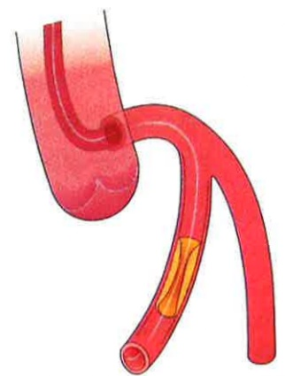

## 三、 心導管如何執行

心導管是利用特製無菌導管經由股動脈(大腿鼠膝部)或橈動脈(手腕處)穿入冠狀動脈探查是否有血管狹窄或阻塞，如果有狹窄的病灶可能使用動脈氣球擴張術撐開狹窄的部位或支架置入。

### 1. 氣球擴張術(Balloon)

(1)將導引導管置放至冠狀動脈開口處：如下圖左

(2)置入導絲通過處：如下圖右

資料來源：義大醫院3樓心導管室

(3)將氣球導管沿著導線置入至病灶處：如下圖左

(4)將氣球導管擴張起來，將狹窄處撐開：如下圖右

資料來源：義大醫院3樓心導管室

(5)持續或反覆擴張氣球

數次：

如下圖左

(6)抽離氣球導管，評估血管擴張效果是否需要進一步置放血管支架：如下圖右

資料來源：義大醫院3樓心導管室