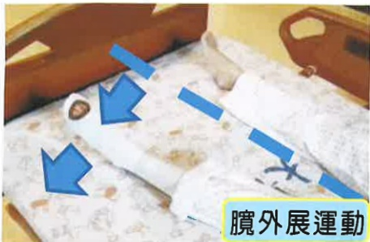
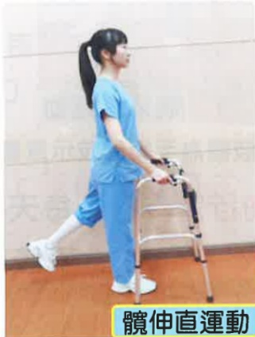

## 二、 術後第一天

1. 冰敷：每天4次，每次15分鐘。

2. 足背運動：每天4次，每次15下

3. 足踝繞圈運動：每天4次，每次15下。

4. 股四頭肌及腦旁肌運動：

彈性襪肢體為手術患肢示意圖

每天4次，每次15下。開刀腳平放，在膝窩處放置毛巾捲，出力下壓毛巾捲，維持5秒後放鬆。目的為增加肌力。

彈性襪肢體為手術患肢示意圖

彈性襪肢體為手術患肢示意圖

5. 髋外展運動及髋屈曲運動：每天4次，每次15下。開刀腳打開及彎曲。目的為增加開刀腳腿部血液循環及關節角度。

彈性襪肢體為手術患肢示意圖

彈性襪肢體為手術患肢示意圖

6. 坐床緣：每天4次，每次5分鐘。目的為循序漸進提升體能。

7. 病房内使用助行器步行，或視情況協助輪椅轉位如第27頁。

## 三、 術後第二天

1. 冰敷：每天4次，每次15分鐘。

2. 足背運動：每天4次，每次15下。

3. 足踝绕圈運動：每天4次，每次15下。

4. 股四頭肌及腦旁肌運動: 每天4次，每次15下。

5. 髋外展運動及髋屈曲運動：每天4次，每次15下。

6. 髖轡曲運動：每天4次，每次15下。

7. 髋伸直運動：每天4次，每次15下。

彈性襪肢體為手術患肢示意圖

彈性襪肢體為手術患肢示意圖

8. 使用助行器步行：每天4次，每次5分鐘。提升體能及下肢肌耐力，助行器使用如第25頁。

9. 視情況協助輪椅轉位如第27頁。

## 四、 術後第三天

1. 冰敷：每天4次，每次15分鐘。

2. 足背運動：每天4次，每次15下。

3. 足踝绕圈運動：每天4次，每次15下。

4. 股四頭肌及腦旁肌運動：每天4次，每次15下。