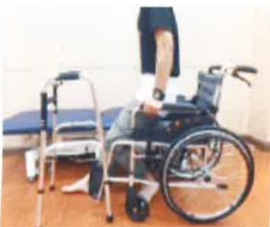

### 2. 上下楼梯正確方式

(1)開刀後的1~3個月內為患肢最大保護期。

(2)請遵守健肢先上樓梯，患肢先下樓梯，兩腳踏在同階梯的原則(口訣為好人健肢上天堂，壞人患肢下地獄)。

繃帶纏綁肢體為手術患肢示意圖

## 七、 步行活動

1. 術後第一天：請盡量鼓勵病人半坐臥（約70度~90度），以預防下床活動時，發生姿勢性低血壓。可採漸進下床，首先搖高，待10分鐘後無不適情形，再坐於床邊5~10分鐘，若無頭暈不適，在他人協助下，再用助行器站立；站立時無頭暈不適，才可使用助行器於病房內走動。

2. 術後第二天以後：可以在病室走道以助行器步行，1 天 4 次，1 次 5 分鐘。活動後臥床休息時，需要抬高並冰敷患肢，以利消腫。

3. 助行器使用至少需維持6~8星期，以預防骨頭未癒合前負重過大。

## 八、 輪椅轉位

## 繃帶纏綁肢體為手術患肢示意圖

1. 站起或坐下時，開刀腳向前伸，健側下肢在後。

2. 站起時，雙手下壓出力，身體向上站起，勿過度前傾。

3. 站起後，雙手移至助行器把手處扶好。

4. 轉位時需確認輪椅或床是否在臀部可坐到的範圍內。