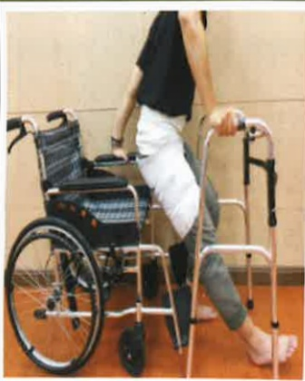

## 三、 返家照護注意事項

1.返家後每天繼續執行在醫院教導的復健運動。

2.傷口儘量保持乾燥，若有紅腫及異常滲液情形，請盡速回診檢查。

3. 避免傷口擦撞及激烈運動(如：跑步、跳躍)，需遵守醫師教導活動限制。

4. 術後 6~8 星期內需使用助行器，直到門診追蹤時醫師認為可以恢復正常活動為止，需要預防跌倒。

5. 當長時間下床活動後，因患肢末稍血液回流速度較慢，腳掌易腫脹情形，故應於下床活動後抬高患肢且冰敷傷口，以利消腫。

6. 下列活動須經醫師認可後才可以執行：開車、半蹲、提重物（3 公斤以上）、走遠路、爬山。

7. 過安檢門的時候機器或許會提示你有攜帶了金屬，可以向安檢員解釋或提供醫院手術證明。

8. 體內、外有金屬品例如：人工關節，禁止深層熱敷（如短波）會因為熱度過度集中而造成燒傷。

9. 當病人有感冒或其他部位感染或看牙科治療時，請主動告知醫師有置換人工關節，以利醫師評估用藥原則。

10. 傷口可碰水時機：醫師告知傷口何時可以碰水後，才可以採淋浴。

11. 若有下列問題應立即返診：

(1)傷口長期仍未痊癒，持續有滲液、異味、流血不止。

(2)傷口有紅腫、傷口周圍皮膚發熱、傷口嚴重疼痛未改善。

(3)持續發燒超過38.5度。

## 壹拾、 居家復健

(一)注意事項：手術後 3 個月內請維持日常生活正確姿勢，避免危險動作

上下床姿势

關節不彎曲超過90度

雙腳不交叉

開刀腳不過度扭轉

站起與坐下

雙手出力扶扶手

關節不彎曲超過90度

扶好助行器穗走