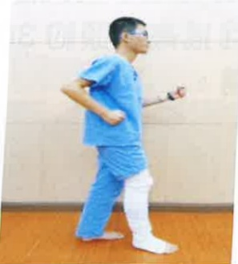

## 關節彎曲活動角度

訓練目的：增加患側關節循環及維持關節角度

圖片繃帶纏綁肢體為手術患肢示意圖

## 平躺姿勢：盡可能將大腿/膝蓋彎曲，再慢慢伸直

## 平躺姿势使用毛巾協助：盡可能將大腿/膝蓋彎曲，再慢慢伸直

## 坐姿：盡可能將大腿/膝蓋彎曲，再慢慢將腳放回地面

## 強化上臂肌力

訓練目的：增加雙側上肢肌力，幫助手術後轉位及使用助行器能力

使用有扶手的固定式椅子，盡可能伸直手肘並抬起身體，再慢慢將身體降下至椅面

## 强化心肺耐力

## 訓練目的：增加手術前心肺耐力 圖片繃帶纏綁肢體為手術患肢示意圖

##  $ ^{※} $ 固定式腳踏車10分鐘

 $ ^{※} $  腳踏車高度：腳踩到底，膝蓋接近伸直

##  $ ^{※} $ 行走於安全平面10分鐘

物理治療師貼心提醒您，小心安全，預防跌倒義大醫療財團法人 復健科物理治療團隊 製作