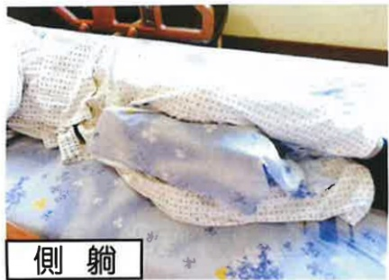
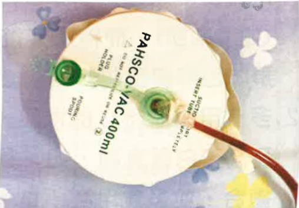

## 伍、 手術後照護須知

## 一、 手術後肢體擺位及照顧注意事項

1. 手術後，我們將協助您把腿部向外自然展開，且會為您在兩腿之間放置一個枕頭（三角枕），保持兩腳打開使髖關節外展至少30度以防脫臼。

2.術後為了預防患肢腫脹，造成疼痛及末梢循環障礙，可用枕頭將手術之腿部墊高，可減輕水腫。

平 躺

側 躺

3.冰敷手術部位降低患處疼痛及腫脹，應經常更換冰敷位置，避免血液循環障礙，且夜間入睡後應停止冰敷。

4. 術後因防止病人發燒及肺部擴張不全，要經常深呼吸咳嗽。醫護人員將會協助教導每2小時翻身拍背（避開腰部及脊椎）。請病人加強水分攝取，一天 2000~3000cc（但有限水病人除外）。

5. 可搖高床頭約 30度~45度 以方便進食及預防嘔吐造成嗆傷。

## 二、 管路放置注意事项

## (一) 留置導尿管

1. 基於手術後活動安全，故手術後會留置導尿管。

2. 醫護人員會評估拔除留置導尿管的時機。

3. 留置導尿管會固定在大腿內側(女生)或下腹部(男生)。

4. 尿袋要放在低於膀胱的地方，

高於膀胱易導致尿液逆流而感染。尿袋底部要離地至少3公分以上，免接觸地面。

5.若是出現有尿量持續減少或膀胱脹痛情形，請確認管路是否有反摺，並請醫護人員協助處理。

離地面至少3公分

## (二) 引流管

1. 術後於患肢手術處會放一條引流管，引流血水預防血腫。

2. 引流管放置期间，除了要预防管路滑脱外，在Y型接管处更须时常挤压。冰敷时也应避免冰敷引流管，防止血块形成阻塞。

