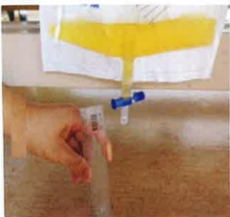

## 尿管護理：

外科加護病房病人多數因手術需要、需密切監測尿液，或是急性尿滯留而放置導尿管使用，若導尿管照護不當易造成感染，故每日應清潔會陰部及導尿管。

1. 將便盆或尿布垫在病人臀部下方，以沖洗壺沖水。

2. 用肥皂水或沐浴

乳塗抹於病人尿道口、會陰部及

尿管上段處再以清水沖洗乾淨。

3. 將病人尿道口、會陰部及尿管上段以濕紙巾擦乾。

4. 協助更換乾淨尿布或衣褲。

5. 尿袋位置需維持在膀胱以下，尿袋口離地3公分以上，且開口應隨時關閉，尿袋內尿量超過1/2至2/3應倒掉。