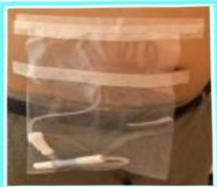

## 我大醫療財團法人 E-DA HEALTHCARE GROUP

## 二、 預防導管出口感染篇

1. 維持個人及環境衛生，每日更換乾淨衣物。

2. 每日淋浴洗澡，淋浴時要套上拋棄式人工肛門袋，防止洗澡水汙染，淋浴後儘速執行導管出口護理，保持乾燥。

3. 避免泡澡、泡湯、洗三溫暖或游泳，很容易發生導管出口感染。

4. 新植管後導管出口還未完全癒合，以及可能有感染症狀的出口，切勿淋浴；上半身可用濕毛巾擦拭，下半身再以清水沖洗，以免沾濕導管出口，造成更嚴重的感染。

5. 過管出口沾濕或髒污了，一定要盡快換藥，尤其是夏天天氣悶熱流汗量多的時候。

6. 執行導管出口護理時，不開冷氣及電風扇，以免空氣中的灰塵會汙染到導管出口。

7. 過管出口有紅腫熱痛、分泌物或瘧肉時，請立即回腹膜透析室處理，並增加換藥次數。

8. 過管出口勿自行塗抹非醫師開立的藥膏或任何藥粉、凡士林、乳霜等。

9. 固定好導管不要拉扯到，褲腰帶勿繫在導管出口處上，勿摩擦或抓傷導管出口，若有皮膚癢可請醫師開立止癢藥膏使用。

10. 使用固定帶固定導管，以保護導管。

## 三、 洗澡篇

1. 人工肛门袋的使用：

## 四、 運動篇

1. 運動前要先固定好導管，以下適合的運動：散步、快走、登山、騎腳踏車、練氣功、跳舞（如土風舞、交際舞等慢舞）、暖身操等。

2. 禁忌的運動：

(1) 可能會拉扯到腹膜透析導管的運動，如：仰臥起坐、打拳、武術等。

(2) 容易讓腹部內導管移位的運動，如：倒立、抬腿。

參考資料：

1. 楊馥妃(2023)·照顧一位初次腹膜透析病人導管滲漏之照護經驗·臺灣腎臟護理學會雜誌，21(2)，1-13。

2. 第28梯次護理人員腹膜透析訓練班(2023)·臺灣腎臟醫學會。

| 聯絡資訊 |
|----------|
| 義大醫院地址:高雄市燕巢區角宿里義大路1號電話:07-6150952 義大癌治療醫院地址:高雄市燕巢區角宿里義大路21號電話:07-6150022 義大大昌醫院地址:高雄市三民區大昌一路305號電話:07-6150208 |