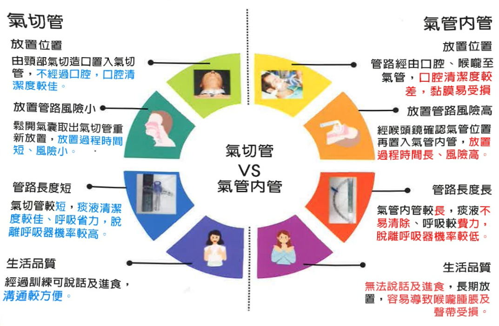

## E-DA HEALTHCARE GROUP

## 氣切造口簡介

▶氣切是在氣管環上切開一個開口與氣管相通，稱其切開口為氣管造口術，常以氣切簡稱。

1. 呼吸衰竭無法脫離呼吸器  

2. 疾病因素需要長期依賴呼吸器  

3. 隨時有呼吸道阻塞危險的病人

## 氣切跟氣管內管有什麼差別

## 氣切管

放置位置

由頸部氣切造口置入氣切管，不經過口腔，口腔清潔度較佳。

放置管路風險小

鬆開氣囊取出氣切管重新放置，放置過程時間短、風險小。

## 管路長度短

氣切管較短，痰液清潔度較佳、呼吸省力，脫離呼吸器機率較高。

生活品質

經過訓練可說話及進食，

溝通較方便。

## 氣管內管

放置位置

管路經由口腔、喉嚨至

氣管，口腔清潔度較

差，黏膜易受損

## 放置管路風險高

經喉頭鏡確認氣管位置再置入氣管內管，放置過程時間長、風險高。

## 管路長度長

氣管内管較長，痰液不易清除、呼吸較費力，脫離呼吸器機率較低。

## 生活品質

無法說話及進食，長期放置，容易導致喉嚨腫脹及聲帶受損。