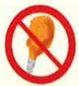

## 一、 簡介

溫和飲食是一種無刺激性，含低纖維，易於消化，具有足夠營養的飲食。可減低消化性潰瘍或胃炎病人消化系統的負擔，並提供充分的營養。

## 二、 適用對象

（一）消化性潰瘍（胃潰瘍、十二指腸潰瘍）者。

(二) 胃炎者。

## 三、 一般飲食原則

(一)細嚼慢嚥，定食定量，少量多餐。

(二)避免純吃澱粉、每餐搭配以澱粉+蛋白質+脂肪的食物為佳。

(三)飲食應含有足夠的營養且無刺激性。

## (四) 急性胃炎时；

先禁食1-2天，讓胃休息，

可喝少量的水以防止口渴。

少量多餐方式，

漸進供給牛奶及流質。

逐漸增加食物的量及種類，並以低脂食物為佳。

(五) 消化性潰瘍，依程序不同分為三期：

## 第一期(自出血至止血後的2-3天):

1. 清流質飲食。

2. 將低糖無油的食物製成流質。

✗ 第二期（止血後的2-3天至恢復期）：流質、軟質食物或溫和飲食。

## 第三期(恢复期)：

此時的飲食與普通飲食相仿，除非病人感到不適，否則應盡量選擇各類食物。

