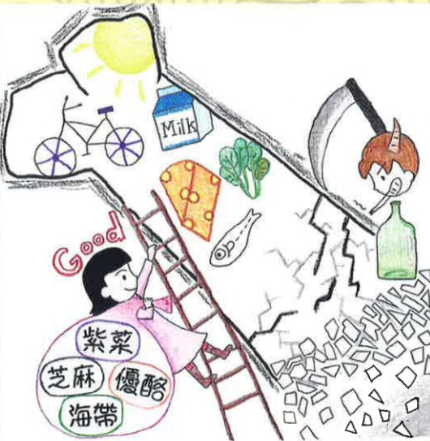

藥物：任何會引起暈眩或方向感迷失的物質，如：酒類、藥物、鎮定劑等，都具有潛在性危險。

## 六、 參考文獻

干堯欽（2020）·中醫在骨質疏鬆症扮演的角色·台灣更年期醫學會會訊，63，25-29。明芬（2023），骨質疏鬆症的飲食建議·台灣更年期醫學會會訊，70，18-19。

彰岑、何健章、姜義浪、林育如、陳昀宗（2024）·長期八段錦訓練改善高齡女性的身體組成、骨質密度及步態穩定性·運動表現期刊，11（1），83-99。

義大醫院

地址：高雄市燕巢區角宿里義大路1號

電話：(07)615-0011

義大癌治療醫院

地址：高雄市燕巢區角宿里義大路21號

電話：(07)615-0022

## 認識骨質疏鬆症 之中醫護理

義大大昌醫院

地址：高雄市三民區大昌一路305號

電話：(07)559-9123

本著作權非經製作權人同意不得轉載翻印或轉售

著作權人：義大醫療財團法人

21*29.7cm 2025.01印製 2024.07修訂 HA-8-0003(3)

