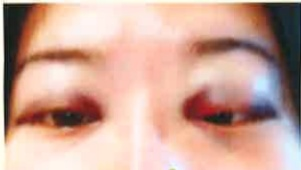

## 一、 何謂「眼針」

「眼針」療法是利用特製之極細軟針，從眼眶周圍的睛明、球後等穴位進行針灸，通過眼眶與眼球間的軟組織空隙至神經束鞘，可改善眼睛血液循環、幫助視神經修復與調節眼睛周圍肌肉組織，防止視力惡化。

## 二、 「眼針」適應症

透過局部眼針針灸治療，可同時調控眼部肌肉、血管、神經、經絡及氣的循環，對青光眼、視網膜剝離、黃斑部病變、弱視、視神經萎縮或高度近視、乾眼症等眼底疾病，皆具有療效。

## 三、 「眼針」手法

醫師運用特製針具，垂直刺入皮膚隨後針尖微呈弧形朝眼球後方緩慢進入；進針由淺至深過程會出現局部酸脹麻感，接著眼眶內及眼球後之深層酸脹麻感會傳至頭頂或枕後，此乃「得氣」，表示眼睛內外經絡疏通中。

## 四、 「眼針」安全性

「眼針」如同身體其他穴位的針灸治療，且因眼球周圍微血管密集，若於進針時過度緊張、留針期間頻張眼或轉動眼球出血機率相對增加；高齡、高度敏感怕痛、肝硬化、血小板疾患、洗腎等凝血功能異常或服用抗凝血劑，對針灸恐懼者不宜接受此療法。

## 五、 「眼針」出血處理

為降低「眼針」出血率，針具已由針頭「尖銳」改良成「圓弧形」。出血輕者僅眼眶周圍與眼皮出現如眼影般的瘀青或如熊貓眼（如圖一）：極少數體質或血管結構特殊者，可能出現眼眶內血腫、眼皮腫脹下垂及眶內腫脹感，會有一至二天難以張開眼睛，經冰敷及服藥消腫後並不影響原有視力。出針後，應確實按壓穴位約3~5分鐘以預防及減輕出血，若仍出血瘀腫應立即於眼睛周圍冰敷且避免按壓眼球：若離院後才緩慢出現瘀腫，則應自行於72小時內冰敷，每15-20分鐘休息30分鐘以免凍傷，72小時後再熱敷，可促進瘀血吸收；血腫於一至兩週後可大幅吸收消失。

(圖一)

## 六、 預防與保健

## （一） 飲食：

1. 避免辛辣、酒、濃茶、咖啡等可能引起眼壓升高之飲食。

2. B-葫蘿蔔素分解後可形成維生素A，維生素A則可預防夜盲症、乾眼症，如胡蘿蔔、菠菜、羅曼葉、荷蘭芹、萵苣、南瓜、蕃薯、花椰菜。

3. 維生素C: 可抗氧化，防止視網膜遭紫外線傷害、防止水晶體老化，增加眼睛內細小血管韌性、修護細胞，有助眼球健康，如芭樂、奇異果、柳橙、葡萄柚、青椒、草莓。

4. 花青素: 可促進眼睛視紫質生長，可穩定眼部微血管，增加眼部微血管循環；也是強抗氧化劑，可減少自由基的傷害，有助預防白內障和黃斑部退化，如藍莓、黑莓、櫻桃、紫甘藍、茄子、紅石榴。

5. 類黃蘿蔔素中只有「玉米黃素」與「葉黃素」存在於視網膜，有助阻擋傷害眼睛的藍光，使視網膜黃斑部免於受害，如菠菜、花椰菜、荷蘭芹、洋蔥、蘆筍、玉米、南瓜、柳橙、菠菜、芥藍。

## （二） 生活須知：

1. 針灸後應避免跑步、重訓、仰臥起坐、便祕、提重物、彎腰、用力打噴噓及咳嗽，以免眼壓升高。