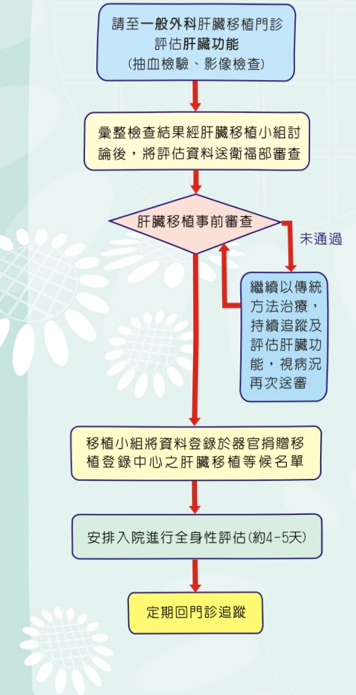

## 伍、 手術前評估

肝臟移植是一項具較高風險且長時間的手術，所以手術前需執行全身性評估，以了解病人對長時間手術之耐受性、是否存在淺在性疾病及術後可能之併發症。以下為手術前評估項目：

(一)抽血檢驗，包含血型、肝腎功能、腫瘤標記、動脈氣體分析、B型或C型肝炎病毒量、伺機性感染病毒檢測…等。

（二）尿液（包含24小時尿液蒐集）及糞便檢驗。

(三)心肺功能評估，包含心電圖、心臟超音波、心臟血液掃描、胸部X光及肺功能檢查。

(四)影像學檢查，包含腹部超音波、電腦斷層或核磁共振、骨質密度、乳房超音波（女性）。

(五)內視鏡檢查，包含胃鏡及大腸鏡。

(六)會診相關科別，包含心臟内科、胸腔内科、麻醉科、精神科及牙科等。

(七)若您是肝腫瘤病人需加做骨骼掃描。若是威爾森氏症病人則需做血液及尿液銅離子之檢測。

(八)其他檢查則視病人狀況而定，如：正子攝影

完成移植手術前評估且病況穩定時，即可返家等候和定期門診追蹤。

## 陸、接受肝臟移植手術的流程

肝臟來源可分為屍體（包含腦死或心死）或活體：前者當接獲移植小組通知時，請依指示禁食並前往急診室辦理住院；後者需經醫學倫理委員會審查通過才能安排手術。肝臟手術時間約為8~12小時，手術後需轉至加護病房照護約3~5天，待病況穩定後轉移植病房（單人房隔離照護），住院總天數約14~21天。

## 染、返家照顧及定期門診追蹤

移植手術後即開始對病人及家屬進行返家照顧衛教，包含認識排斥現象、熟悉藥物、飲食、預防感染、居家照顧…等。

由於新移植的肝臟非自身之器官，所以須終身服用抗排斥藥物，但抗排斥藥物又會降低本身的免疫系統，因此定期回門診追蹤非常重要。

## 義大醫院

地址：高雄市燕巢區角宿里義大路1號

電話：(07)615-0011

分機：5855、5853、5852

網址: http://www.edah.org.tw

本著作權人非經著作權人同意不得轉載翻印或轉售

著作權人：義大醫療財團法人

29.7×21cm 2024.01印製 2023.12修訂 HA-9-0017(2)

## 認識肝臟移植

## 前言

肝臟是人體中不可或缺的重要器官之一，當它失去功能時，將漸漸走上衰竭之路，進而需要肝臟移植。由於移植手術的精進，抗排斥藥物不斷的推陳出新，大幅減少術後器官排斥及藥物副作用之產生，使得肝臟移植術後一年存活率達93%，而五年存活率則達75%。以下是肝臟移植簡介：

## 壹、 何時需要肝臟移植

當肝臟出現不可逆性的進行性肝病，且無其他方法可以有效治療時，肝臟移植是唯一選擇延續生命的治療方法。

## 貳、肝臟移植的適應症

(一) 病毒性肝炎引起的肝硬化 (B型肝炎、C型肝炎)。

(二)原發性肝臟惡性腫瘤，且肝功能不適合腫瘤切除手術者(根據文獻及衛福部規範：單一腫瘤大小小於6.5公分，多發腫瘤數目小於3顆，任一腫瘤最大直徑不大於4.5公分，且總直徑不大於8公分)。

(三)猛爆性肝炎或藥物引起之急性肝衰竭。

(四)威爾森氏症(銅離子代謝異常)。

(五)先天性膽道閉鎖(在台灣以兒童常見)。

(六) 原發性膽汁滯留性肝硬化：

(1) 原發性膽汁性肝硬化。

(2) 原發性硬化性膽管炎。

(七)其他末期肝臟疾病，無法以傳統方式治療者

## 參、肝臟移植的禁忌症

(一)有無法控制的感染者。

(二) 愛滋病帶原者，但需符合以下規定：

(1) CD4數值大於200 cell/ $ \mu $ l至少6個月。

(2) 遵循醫囑並穩定接受雞尾酒療法，且最近6個月內檢測病毒小於50copies/ml。

(3) 排除有未受控制、潛在致命之伺機性感染或腫瘤。

(4)日後仍有抗逆轉錄病毒之治療選擇。

(三)肺結核未完全治療者。

(四)有惡性腫瘤者(不包含原發性肝腫瘤)。

(五)經臨床評估無法長期配合移植術後治療者。

(六)嚴重心肺功能障礙者。

(七)嚴重腦血管或周邊血管病變，使日常生活無法自理，且無法接受重建手術者。

(八)免疫系統不全或自體免疫疾病，雖經治療仍預後不良者。

(九)藥癮患者。

(十)酒癮戒酒未超過半年者。

肆、肝臟移植事前審查

